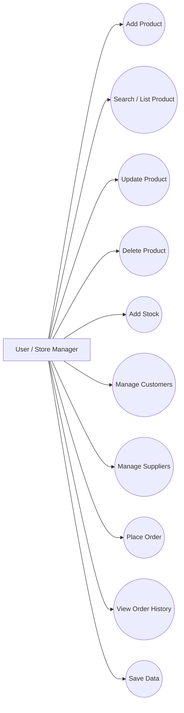
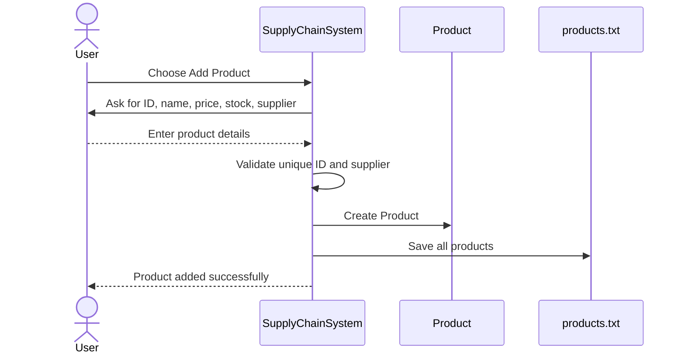
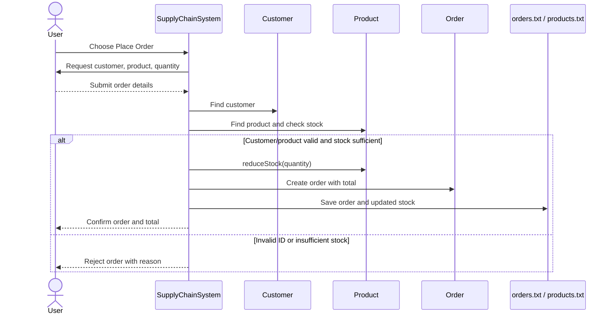

# UML Diagrams

The Mermaid diagrams below can be rendered in Mermaid Live Editor or compatible Markdown viewers.

## 1. Use Case Diagram

## 2. Class Diagram

```mermaid
classDiagram
    class Person {
      <<abstract>>
      #int id
      #string name
      #string contact
      +getId() int
      +role()* string
      +display() void
      +save(ofstream&) void
      +~Person()
    }
    class Customer {
      +role() string
      +save(ofstream&) void
    }
    class Supplier {
      -string company
      +role() string
      +display() void
      +save(ofstream&) void
    }
    class Product {
      -int id
      -string name
      -double price
      -int stock
      -int supplierId
      +addStock(int) void
      +reduceStock(int) bool
      +display() void
      +save(ofstream&) void
    }
    class Order {
      -int id
      -int customerId
      -int productId
      -int quantity
      -double total
      +display() void
      +save(ofstream&) void
    }
    class SupplyChainSystem {
      -vector~unique_ptr~Product~~ products
      -vector~unique_ptr~Customer~~ customers
      -vector~unique_ptr~Supplier~~ suppliers
      -vector~unique_ptr~Order~~ orders
      +addProduct() void
      +searchProduct() void
      +updateProduct() void
      +deleteProduct() void
      +placeOrder() void
      +saveAll() void
      +loadAll() void
    }
    Person <|-- Customer
    Person <|-- Supplier
    SupplyChainSystem o-- Product
    SupplyChainSystem o-- Customer
    SupplyChainSystem o-- Supplier
    SupplyChainSystem o-- Order
```

## 3. Sequence Diagram — Add Product

## 4. Sequence Diagram — Place Order

